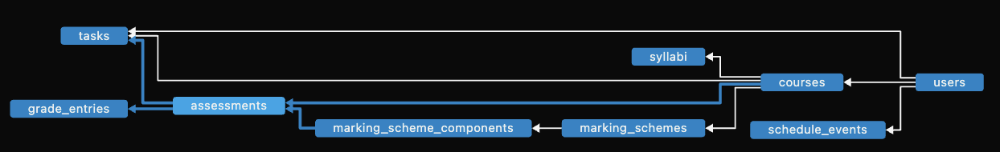

# Schema Proposal — Syllabus Assistant
_Prepared on Nov 9, 2025 by Andy Chen_
## Purpose
This document defines the relational schema that anchors persistence for the Syllabus Assistant. It aligns with the domain entities captured in `doc/project-blueprint.md` and the sequencing described in `doc/timeline-proposal.md`. All tables target SQLite for local development while keeping the design portable to other relational engines.

## Design Principles
- **Stable identifiers** — Every table uses externally generated `TEXT` primary keys (UUID-friendly) to keep services deterministic across imports.
- **Layer alignment** — Table names map directly to aggregates in `entity`, simplifying repository implementations and keeping `use_case` ports independent from data access concerns.
- **Cascade hygiene** — Foreign keys employ `ON DELETE CASCADE` or `SET NULL` so dependent records cannot orphan when upstream data is removed.
- **Enum safety** — `CHECK` constraints specify valid values for status and type columns to catch invalid writes early.

## Table Overview

- **`users`** — Stores authentication and profile information, including hashed passwords and time zone preferences used for schedule rendering.
- **`courses`** — Represents a course owned by a user, capturing metadata such as term and instructor.
- **`syllabi`** — Tracks uploaded syllabus sources, parsed timestamps, and raw text snapshots for reprocessing or auditing.
- **`marking_schemes`** — Holds grading blueprints per course; multiple schemes allow alternative grading policies.
- **`marking_scheme_components`** — Normalizes weight components (assignments, exams, etc.) for each scheme.
- **`assessments`** — Individual assessments extracted from syllabi, optionally tied to a scheme component.
- **`tasks`** — (Similar to assessments, this table will be added once everything is complete) Actionable items surfaced to the user, linked to assessments when applicable.
- **`grade_entries`** — Logged grades for assessments, enabling projections and historical tracking.
- **`schedule_events`** — Events exported to calendars, tagged by source (`ASSESSMENT` or `TASK`) for traceability.

## Relationships & Indexes
- `courses.user_id → users.user_id` cascades deletes to child records.
- `assessments` reference both `courses` and optional `marking_scheme_components`.
- `tasks` bridge users, courses, and assessments to support personal prioritization.
- Secondary indexes accelerate common lookups (e.g., tasks by user/status, assessments by course).

## Proposed DDL
The following DDL is synchronized with the section in `README.md` and applied to `src/main/resources/db/syllabus_assistant.db` for local development.

```sql
PRAGMA foreign_keys = ON;

CREATE TABLE users (
    user_id TEXT PRIMARY KEY,
    name TEXT NOT NULL,
    email TEXT NOT NULL UNIQUE,
    timezone TEXT,
    password_hash TEXT NOT NULL,
    created_at TEXT NOT NULL DEFAULT (datetime('now')),
    updated_at TEXT NOT NULL DEFAULT (datetime('now'))
);

CREATE TABLE courses (
    course_id TEXT PRIMARY KEY,
    user_id TEXT NOT NULL,
    code TEXT NOT NULL,
    name TEXT NOT NULL,
    term TEXT,
    meeting_info TEXT,
    instructor TEXT,
    FOREIGN KEY (user_id) REFERENCES users(user_id) ON DELETE CASCADE
);

CREATE TABLE syllabi (
    syllabus_id TEXT PRIMARY KEY,
    course_id TEXT NOT NULL,
    source_file_path TEXT,
    parsed_at TEXT,
    raw_text TEXT,
    version INTEGER DEFAULT 1,
    FOREIGN KEY (course_id) REFERENCES courses(course_id) ON DELETE CASCADE
);

CREATE TABLE marking_schemes (
    scheme_id TEXT PRIMARY KEY,
    course_id TEXT NOT NULL,
    title TEXT,
    effective_from TEXT,
    FOREIGN KEY (course_id) REFERENCES courses(course_id) ON DELETE CASCADE,
    UNIQUE (course_id, title)
);

CREATE TABLE marking_scheme_components (
    component_id TEXT PRIMARY KEY,
    scheme_id TEXT NOT NULL,
    name TEXT NOT NULL,
    type TEXT NOT NULL,
    weight REAL NOT NULL,
    component_count INTEGER,
    FOREIGN KEY (scheme_id) REFERENCES marking_schemes(scheme_id) ON DELETE CASCADE,
    CHECK (weight >= 0 AND weight <= 1),
    CHECK (type IN ('TEST','ASSIGNMENT','EXAM','QUIZ','PROJECT','OTHER'))
);

CREATE TABLE assessments (
    assessment_id TEXT PRIMARY KEY,
    course_id TEXT NOT NULL,
    component_id TEXT,
    title TEXT NOT NULL,
    type TEXT NOT NULL,
    starts_at TEXT,
    ends_at TEXT,
    duration_minutes INTEGER,
    weight REAL,
    location TEXT,
    notes TEXT,
    FOREIGN KEY (course_id) REFERENCES courses(course_id) ON DELETE CASCADE,
    FOREIGN KEY (component_id) REFERENCES marking_scheme_components(component_id) ON DELETE SET NULL,
    CHECK (weight IS NULL OR (weight >= 0 AND weight <= 1)),
    CHECK (type IN ('TEST','ASSIGNMENT','EXAM','QUIZ','PROJECT','OTHER'))
);

CREATE TABLE tasks (
    task_id TEXT PRIMARY KEY,
    user_id TEXT NOT NULL,
    course_id TEXT NOT NULL,
    assessment_id TEXT,
    title TEXT NOT NULL,
    due_at TEXT,
    estimated_effort_mins INTEGER,
    priority INTEGER,
    status TEXT NOT NULL DEFAULT 'TODO',
    notes TEXT,
    FOREIGN KEY (user_id) REFERENCES users(user_id) ON DELETE CASCADE,
    FOREIGN KEY (course_id) REFERENCES courses(course_id) ON DELETE CASCADE,
    FOREIGN KEY (assessment_id) REFERENCES assessments(assessment_id) ON DELETE SET NULL,
    CHECK (status IN ('TODO','IN_PROGRESS','DONE','CANCELLED')),
    CHECK (priority IS NULL OR priority BETWEEN 1 AND 5)
);

CREATE TABLE grade_entries (
    grade_entry_id TEXT PRIMARY KEY,
    assessment_id TEXT NOT NULL,
    points_earned REAL,
    points_possible REAL,
    percent REAL,
    graded_at TEXT,
    feedback TEXT,
    FOREIGN KEY (assessment_id) REFERENCES assessments(assessment_id) ON DELETE CASCADE,
    CHECK (percent IS NULL OR (percent >= 0 AND percent <= 100))
);

CREATE TABLE schedule_events (
    event_id TEXT PRIMARY KEY,
    user_id TEXT NOT NULL,
    title TEXT NOT NULL,
    starts_at TEXT NOT NULL,
    ends_at TEXT,
    location TEXT,
    notes TEXT,
    source_kind TEXT NOT NULL,
    source_id TEXT,
    FOREIGN KEY (user_id) REFERENCES users(user_id) ON DELETE CASCADE,
    CHECK (source_kind IN ('ASSESSMENT','TASK'))
);

CREATE INDEX idx_courses_user ON courses(user_id);
CREATE INDEX idx_syllabi_course ON syllabi(course_id);
CREATE INDEX idx_marking_components_scheme ON marking_scheme_components(scheme_id);
CREATE INDEX idx_assessments_course ON assessments(course_id);
CREATE INDEX idx_tasks_user_status ON tasks(user_id, status);
CREATE INDEX idx_grade_entries_assessment ON grade_entries(assessment_id);
CREATE INDEX idx_schedule_events_user ON schedule_events(user_id);
```
